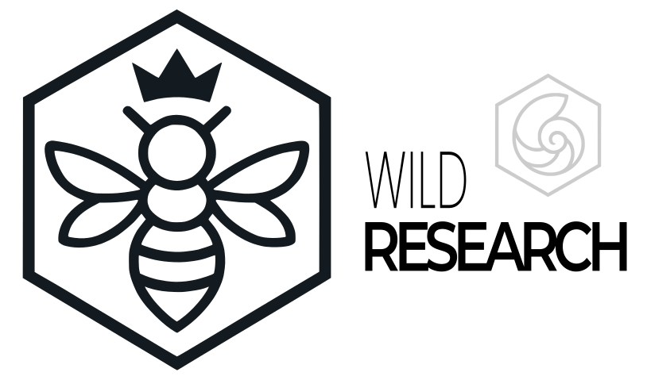

  

---

<h3 align="center">
  Orchestrating Autonomous AI Systems with Precision, Scale, and Cohesion
</h3>

---

## 🧠 About Me
I'm **Joshua Tollette** — AI Architect & Engineer passionate about designing and building **scalable, intelligent systems**.  
I specialize in multi‑agent architectures, AI‑driven automation, and leveraging modern tools like **Go**, **Python**, and **Docker** to bring complex ideas to life.

Currently, I’m focused on an R&D project called the **Wild Research Framework** — an exploration into creating efficient and specialized AI swarms.

---

## 📌 Portfolio Highlights

| Project | Overview |
| ------- | -------- |
| **[👑 Wild Research Framework](https://github.com/joshtol/wild-research-framework-overview)** | *Interactive architecture & visualizations of my Queen–Drone AI swarm system.* _Scaled swarm simulations to **1K+ agents** with **sub‑100ms decision cycles**._ |
| **[🐠 Caribbean Diving Guide 2025](https://github.com/joshtol/caribbean-diving-guide-2025)** | *Comprehensive Caribbean scuba guide generated entirely by a proprietary agentic AI pipeline.* _Full travel dataset generated in **<24h** with end‑to‑end automation._ |

---

## 🛠️ Tech Stack

**Backend & AI**  

**DevOps & Cloud**  

**Frontend**  

---

## 🧩 Core Competencies
- Multi‑Agent System Design & Simulation
- AI‑Driven Automation Pipelines
- Cloud‑Native Architecture & Deployment
- Bridging Simulation and Production Environments
- Continuous Integration of AI Research into Production

---

## 📈 Current Focus
- Scaling **Wild Research Framework** into a deployable, modular AI swarm library.
- Experimenting with swarm ethics & emergent behaviors for real‑world safety.
- Exploring cross‑domain applications of multi‑agent collaboration.

---

## 🤝 Let’s Connect
💬 Always open to conversations on autonomous systems, AI orchestration, and unconventional applications of swarm intelligence.  

---

🐝 Curious? — Check out the hidden [Swarm Logic Demo](https://example.com) for a peek into emergent decision‑making.
